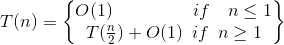
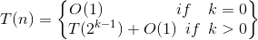
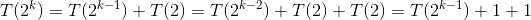
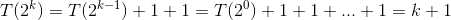
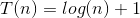

# Requisitos de la sesión

  + Para el inicio de esta práctica, ya deben estar familiarizados con el análisis de algoritmos y la notación **O(n)**.

# Objetivos de la sesión.
  
  + Entender cómo el análisis de la complejidad de un algoritmo trabaja con un ejemplo de código real. 
  + Estudiar el algoritmo de búsqueda binaria, entender su complejidad, y comparlo con la búsqueda lineal.

# Análisis de algoritmos. Notación O. 

Sirva este párrafo de aclaratoria de ideas previas a la práctica. La notación **O(n)** es una herramienta utilizada para dar una idea de la eficiencia de un algoritmo determinado estudiando **su complejidad**. La complejidad de un algoritmo tiene que ver con: **¿qué tan bien escala el algoritmo?**, **¿Cómo varía el tiempo de ejecución del algoritmo para variación en los valores de entrada?**.

En clase, ya se debió introducir la definición matemática de la notación **O(n)**, así como un pequeño apartado sobre el álgebra de **O(n)** y cómo aplicar la notación **O(n)** para el análisis de algoritmos. La siguiente tabla recuerda algunos de los análisis de complejidad encontrados en algoritmos típicos. 

Big-O | Nombre | Descripción.
------| ---- | -----------
**O(1)** | constante | **El mejor tiempo de ejecución.** El Algoritmo siempre toma el mismo tiempo de ejecución sin importar el valor de entrada. Ejemplo: Obtener un elemento en un arreglo usando su posición.
**O(log n)** | logarítmico | Estos tipos de algoritmos reducen a la mitad la cantidad de datos con cada iteración. Si tiene 100 elementos, se necesitan aproximadamente 7 pasos para encontrar la respuesta. . Ejemplo: búsqueda binaria.
**O(n)** | Lineal | Si tienes una entrada . Ejemplo: búsqueda secuencial.
**O(n log n)** | "Lineal logarítmica" |  Un poco inferior en rendimiento con respecto a una complejidad lineal. Ejemplo: Los ordenamientos más rápidos sobre una secuencia.
**O(n^2)** | Cuadrática. | Si tienes 100 items de entrada, esto tomará 100^2 = 10 000 pasos de ejecución. Ejemplo: insertion sort.
**O(2^n)** | Exponencial | Agregar solo un numero a la entrada dobla el número de pasos de ejecución. 
**O(n!)** | Factorial |  Literalmente toma mucho tiempo en hacer algo. Años y años. 

# Algoritmo de Búsqueda Binaria. 

La búsqueda binaria es una de las técnicas más básicas que existen para buscar datos en memoria dentro de un conjunto de datos que esta **ordenado**. El algoritmo de búsqueda binaria en cada llamado disminuye el tamaño de la entrada a la mitad, para continuar la búsqueda en la mitad menor o en la mitad mayor según sea el caso. Puede describirse en la siguiente secuencia de pasos: 

  + Ubiquese en la mitad de la secuencia.
  + Compare la clave de busqueda con el elemento en la posición actual.
  + Si son iguales, ha encontrado el elemento de búsqueda y el algoritmo termina. 
  + Si la clave de búsqueda es menor que el elemento en la posición actual, entonces tiene que estar en la mitad menor de la secuencia. Vuelva a ejecutar el algoritmo sobre la mitad menor si existe. Si no existe, el elemento no está en la secuencia. 
  + Si la clave de búsqueda es mayor que el elemento en la posición actual, entonces tiene que estar en la mitad mayor de la secuencia. Vuelva a ejecutar el algoritmo sobre la mitad mayor si existe. Si no existe, el elemento no está en la secuencia.  

# La búsqueda binaria es un algoritmo de complejidad **O(log n)**. 

El análisis del algoritmo plantea la siguiente ecuación. 

Suponiendo que n = 2^k, es decir, n es una potencia exacta de 2:

Luego, para el segundo caso de la recurrencia:

Sucesivamente: 

Por ultimo, de la suposición n = 2^k

