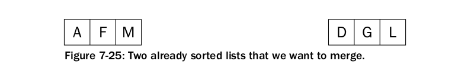

# Operaciones sobre conjuntos modelados con arreglos.

## Requisitos de la sesión

  + Para el inicio de esta práctica, ya deben estar familiarizados con el análisis de algoritmos y la notación **O(n)**.
  + Conocimiento de arreglos unidimensionales . 
  + Familiaridad con los métodos de ordenamiento descritos en clase. Esto es un repaso. 

## Objetivos de la sesión. 
 
  + Entender el costo computacional de las operaciones (inserción, búsqueda, eliminación) sobre un conjunto modelado con un arreglo.

## Búsqueda

El costo de la búsqueda en un conjunto almacenado en un arreglo dependerá de si la secuencia está ordenada o desordenada.

Si la secuencia está desordenada, la búsqueda de una clave se realizará mediante un recorrido secuencial hasta que la clave sea encontrada o hasta recorrer toda la secuencia y descartar su existencia dentro del conjunto. Claramente esto acarrea un costo de _O(n)_.

En caso de que la secuencia esté ordenada, ya se demostró en la clase anterior que la búsqueda se hace efectivamente en _O(Log n)_.

## Inserción

El costo de la inserción de un elemento en una secuencia dependerá de si la secuencia está ordenada o desordenada.

Si la secuencia esta desordenada, el costo de añadir un nuevo elemento es constante O(1). Lo común es que se añada al final de la secuencia, aunque esto último dependerá de cómo esté implementado el tipo arreglo.


Por el contrario, si la secuencia se mantiene ordenada, insertar un nuevo elemento requiere la búsqueda de la posición correspondiente del elemento a insertar, abrir una brecha una vez encontrada, e insertar el nuevo elemento llenando la brecha. 


Este costo no es tan obvio. Analizando el siguiente algoritmo de inserción por brecha, obtenemos la complejidad de insertar en un arreglo ordenado, _O(n)_:  

``` c++
void insert(T a[], const T & e, int & n) {
    int pos_to_insert = binary_search<T, Compare>(a, e, 0, n - 1); // O(Log n)
    for (int i = 0; i > pos_to_insert; i--) // O(n - pos_to_insert)
        a[i] = a[i-1];

    a[pos_to_insert] = e;
    n++;
}
```

## Eliminación

El costo de la eliminación de un elemento en un conjunto almacenado en un arreglo dependerá de si la secuencia está ordenada o desordenada, puesto que para eliminar un elemento es necesario conocer su posición actual dentro de la secuencia.

Si el arreglo está desordenado, conocer la posición del elemento requiere realizar una búsqueda lineal del mismo. Al ser una secuencia desordenada, la brecha dejada por el elemento recien eliminado puede ser llenada por el último elemento del arreglo en tiempo constante
(Al menos en c++, modificando la variable de control que contiene el tamaño actual de un arreglo). 

Esto acarrea un costo de eliminación de O(n) en un arreglo desordenado.

``` c++
void remove_in_unsorted_array(T a[], const T & e, int & n) {
    int pos_to_delete = sequential_search<T, Compare>(a, e, 0, n - 1); // O(n)
    if(a[pos_to_delete] != e)
      //No se encuentra el elemento.
      ;

    a[pos_to_delete] = a[n-1];
    n--;
}
```

Si el arreglo está ordenado, primero se busca la posición actual del elemento en la secuencia y se elimina. Al eliminarlo, es necesario conservar el orden, por lo que el resto de los elementos debe desplazarse hacia la izquierda. El analisis de este algoritmo es 
_T(n) = O(log n) + O(n) = O(n)_

``` c++
void remove_in_sorted_array(T a[], const T & e, int & n) {
    int pos_to_delete = binary_search<T, Compare>(a, e, 0, n - 1); // O(Log n)
    if(a[pos_to_delete] != e)
      //No se encuentra el elemento.
      ;

    for(int i = pos_to_delete; i < n - 1; i++ ) // O(n)
      a[i] = a[i+1];
    n--;
}
```

En resumen

Operacion | Arreglo Ordenado | Arreglo Desordenado.
----------| ----  | --------------
Insertar  | O(n)  | O(1).
Búscar  | O(Log n)  | O(n).
Eliminar  | O(n) | O(n).

# Métodos de Ordenamiento.

Ordenar una secuencia presenta el escenario ideal para entender el analisis de algoritmos y tiempos de ejecución en base a una función _T(n)_ en base al tamaño de la entrada. Se presentan los análisis de tiempos de ejecución para distintos algoritmos de ordenamiento.

## Ordenamineto por selección - _Selection Sort_

El esquema general del ordenamiento por selección es:

  + Buscar el mínimo elemento entre una posición i y el final de la lista.
  + Intercambiar el mínimo con el elemento de la posición i

Una implementación posible en c++:
``` c++
void selection_sort(T a[], const size_t & n) {
    int min;
    for(int i = 0, j; i < n -1; i++) {
      for(min = i, j = i + 1; j < n; ++j)
        if(Compare () (a[j], a[min]))
          min = j;
    }
    if(Compare () (a[min], a[i]))
      swap(a[min], a[i])
}
```

Claramente, debido a la anidación de los ciclos **for**, se deduce 
rapidamente que el algoritmo tiene una complejidad de _O(n^2)_.

## Ordenamiento por inserción - _Insertion Sort_
El algoritmo funciona bajo la premisa de que hay k elementos ordenados de menor a mayor.

 Luego se toma el elemento k+1 y se compara con todos los elementos ya ordenados, deteniéndose cuando se encuentra un elemento menor (todos los elementos mayores han sido desplazados una posición a la derecha) o cuando ya no se encuentran elementos (todos los elementos fueron desplazados y este es el más pequeño). En este punto se inserta el elemento k+1 en su posición de orden relativa.

Una implementación posible en c++:
``` c++
void selection_sort(T a[], const size_t & n) {
  for (int i = 1; i < n; ++i)
    { 
      int j = i;

    while (j > 0 and cmp(a[j], a[j-1]))
	  {
	    swap(a[j], a[j-1]);
	    --j;
	  }
  }
}
```

Para este algoritmo pueden suceder dos cosas: 
  
  + El intervalo está ordenado en [0, i -1]. En ese caso, el **while** no ejecuta ninguna repetición y es _O(1)_. El método completo entonces es _O(n)+O(1) = O(n)_.
  
  + El intervalo [0, i-1] está ordenado invertidamente (de mayor a menor). En ese caso, el ciclo itera _n-i_ veces. Como _i_ depende de _n_, directamente se puede concluir que el método completo es _O(n)+O(n) = O(n^2)_.

Ambos casos expuestos son el mejor y el peor caso posibles. Poco probables entre todas las permutaciones existentes para un conjunto especifico. Lo más probable es que el algoritmo ejecute en un tiempo que se acote entre ambos resultados. 

## Ordenamiento rápido - Quicksort

El algoritmo trabaja de la siguiente forma:

  + Elegir un elemento de la lista de elementos a ordenar, al que llamaremos pivote.

  + Resituar los demás elementos de la lista a cada lado del pivote, de manera que a un lado queden todos los menores que él, y al otro los mayores. Los elementos iguales al pivote pueden ser colocados tanto a su derecha como a su izquierda, dependiendo de la implementación deseada. En este momento, el pivote ocupa exactamente el lugar que le corresponderá en la lista ordenada.

  + La lista queda separada en dos sublistas, una formada por los elementos a la izquierda del pivote, y otra por los elementos a su derecha.

  + Repetir este proceso de forma recursiva para cada sublista mientras éstas contengan más de un elemento. Una vez terminado este proceso todos los elementos estarán ordenados.

 La eficiencia del algoritmo depende de la posición en la que termine el pivote elegido.

  + En el mejor caso, el pivote termina en el centro de la lista, dividiéndola en dos sublistas de igual tamaño. En este caso, el orden de complejidad del algoritmo es O(n·log n).

  + En el peor caso, el pivote termina en un extremo de la lista. El orden de complejidad del algoritmo es entonces de O(n²). El peor caso dependerá de la implementación del algoritmo, aunque habitualmente ocurre en listas que se encuentran ordenadas, o casi ordenadas. Pero principalmente depende del pivote, si por ejemplo el algoritmo implementado toma como pivote siempre el primer elemento del array, y el array que le pasamos está ordenado, siempre va a generar a su izquierda un array vacío, lo que es ineficiente.

  + En el caso promedio, el orden es O(n·log n).

## Ordenamiento por mezcla - Mergesort

El ordenamiento por mezcla se sustenta sobre dos conceptos fundamentales:

+ Una secuencia de un elemento está ordenada.
+ El concepto de mezclar dos secuencias que ya estén ordenadas en una nueva secuencia que sigue estando ordenada.

El concepto de mezcla se pictoriza en la siguiente secuencia de imagenes: 




Basandose en ambos conceptos, una secuencia se puede ordenar con el siguiente algoritmo:

+ Se pica la secuencia original en dos secuencias.
+ Se ordena cada una de esas subsecuencias.
+ Se **mezcla** cada una de las subsecuencias una vez ordenadas en una nueva secuencia.

``` c++
void mergesort(T a[], const size_t & l,  const size_t & r) {
  if(l >= r)
    return;

  const int m = (l+r)/2;

  mergesort<T, Compare>(a,l,m);
  mergesort<T, Compare>(a,m+1,r);

  if(Compare()(a[m], a[m+1]))
    return;

  merge<T, Compare>(a, l, m, r);
}
```

El analisis visto en clases demuestra que el tiempo de ejecución del mergesort viene dado al analizar el tiempo de ejecución que toma ordenar cada una de las particiones más el tiempo que conlleva mezclar por barrido, cuando el tamaño de la entrada en mayor que 1. 
__T(n) = 2T(n/2) + O(n)__. Esto lleva a la recurrencia: 

;

El resultado de esta recurrencia es el tiempo de ejecución del mergesort: _O(n·log n)_.

En resumen

Metodo | Complejidad | Tipo.
----------| ----  | --------------
Insertion-sort  | O(n^2)  | Determinista.
Selection-sort  | O(n^2)  | Probabilistico.
Quicksort  | O(n log) | Probabilistico.
Mergesort  | O(n log) | Determinista .